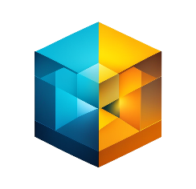

# Cuby

Cuby is a lightweight metric store with minimal abstractions. It enables fetching metrics, filtered by dimensions, by parsing metric queries based on a data model. The data model defines dimensions and metrics similar to Looker and supports inner joins on primary keys. The data model is defined in YAML files. The package generates a SQL query that you can use in SQLAlchemy to fetch your results.

## Installation

To install the package, navigate to the directory containing the package (the parent directory of `dotcube/`) and run:

```bash
pip install -e .
```

## Usage

MetricStore can be used both as a Python library and through its command line interface (CLI).

### As a Python Library

You can import the `load_cubes`, `load_datasource`, `generate_sql_query`, and `fetch_results` functions from their respective modules to use in your Python code.

### CLI Commands

To list all models:

```bash
python -m dotcube.cli list_models
```

To list all metrics for a model:

```bash
python -m dotcube.cli list_metrics <cube_name>
```

To execute a query on a model:

```bash
python -m dotcube.cli query <cube_name> "<query>"
```

The `query` command expects a JSON string as its argument. Here's an example:

```bash
python -m dotcube.cli query cube1 "{'fields': ['booking_date', 'annual_recurring_revenue', 'churned_revenue'], 'filter': {'country_id': '45', 'product_brand': 'BIG'}, 'sorts': ['booking_date'], 'limit': 300}"
```

## Defining Models

Models are defined in YAML files with the following structure:

```yaml
name: <cube_name>
table: <table_path>
dimensions:
  - name: <dimension_name>
    sql: <sql_expression>
  ...
metrics:
  - name: <measure_name>
    sql: <sql_expression>
  ...
```

## Defining Datasources

Datasources are defined in a `datasource.yml` file with the following structure:

```yaml
type: <database_type>
host: <host>
port: <port>
database: <database_name>
user: <username>
password: <password>
```

Supported database types are PostgreSQL, Snowflake, Redshift, BigQuery, and Druid.

## Contributing

If you have suggestions for how DotCube could be improved, or want to report a bug, open an issue! We'd love all and any contributions.
